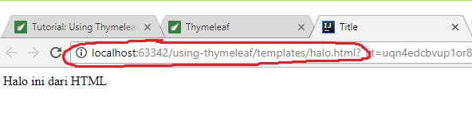
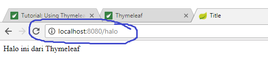
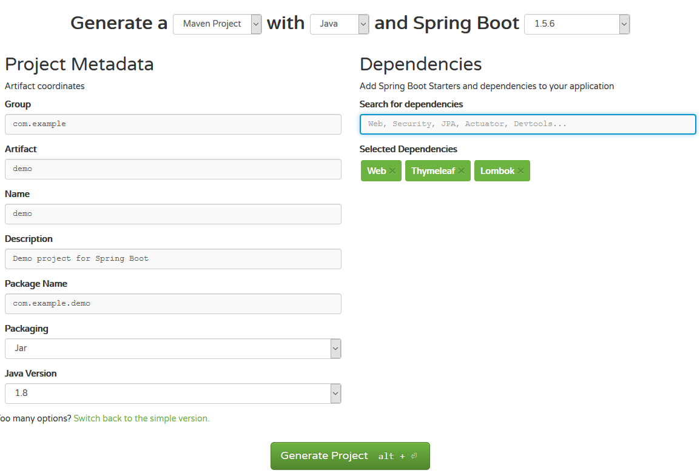

# Menggunakan Thymeleaf


## Overview Thymeleaf

Thymeleaf adalah Java Library yang digunakan untuk mentrasformasikan (render) data 
atau mem-produce text dari server, thymeleaf ini berbentuk XML/HTML format.

Tujuan utama dengan menggunakan thymeleaf ini adalah memisahkan 
antar logic code (__service__) dengan tampilan (__presenter__). Jadi dengan thymeleaf ini
kita diberikah fungsi-fungsi khusus yang hanya dengan menggunakan attribut dalam XML/HTML
yang nantinya setelah di jalankan di server datanya akan diolah dan ditampilkan sesuai dengan real datanya.
Mungkin di antara pembaca agak bingung dengan konsep ini baik lah saya jelaskan ya!! 

Jadi magsudnya itu dengan menggunakan template engine kita menuliskan perintah HTML bisa tapi begitu di jalakan di 
sisi server datanya akan otomatis berubah berikut contoh scriptnya:

```html
<div th:text="'Halo ini dari Thymeleaf'">Halo ini dari HTML</div>
```

Nah jadi disini ada 2 environtment yang berbeda yaitu di sisi client dan server, oklah jadi di sisi client ketika file `.html` 
dijakanakan secara langsung maka di browser anda akan menampilkan value `Halo ini dari HTML`. nah sedangkan di sisi server side 
(Thymeleaf yang di render oleh web server java seperti apache tomcat, jetty dll) nantinya kan menghasilkan 
value `Halo ini dari Thymeleaf`

Dijalankan langung dari file:



Dijalankan menggunakan springboot dengan template engine thymeleaf:



## Standard Dialect in Thymeleaf

Standard dialect ini merupakan tag atau attribut tambahan yang disisipkan dalam element HTML/JavaScript/CSS dll yang bertujuan 
untuk menampilkan object yang diset dari request servlet conteks yang kemudian dirender. Contohnya jika anda sudah lumayan familiar dengan JSP contohnya seperti ini:

```jsp
<form:input type="text" path="someProperty"/>
```

Maka jika menggunakan thymeleaf standar dialect seperti berikut:

```html
<input type="input" name="someProperty" value="Halo ini dari HTML" th:value="Halo ini dari Thymeleaf"/> 
```

## Membuat Project

Untuk membuat Project kita bisa menggunakan Tempate projectnya springboot yang bisa digenerate dari sitenya springframework yaitu
[start.spring.io](https://start.spring.io) nanti akan muncul halaman seperti berikut:



Kemudian kita bisa pilih dependencynya yaitu `WEB`, `Thymeleaf` dan `Lombok` setelah itu isi `artifactId`, `groupId` kemudian click Generate Project.
Setalah itu nanti dia akan didownload, setelah download selesai langsung diextract saja, nani akan terbuat strukut dir project maven seperti berikut:

```bash
Folder PATH listing for volume Windows10
Volume serial number is 52C4-3896
C:.
├───.mvn
│   └───wrapper
└───src
    ├───main
    │   ├───java
    │   └───resources
    │       ├───static
    │       └───templates
    └───test
```